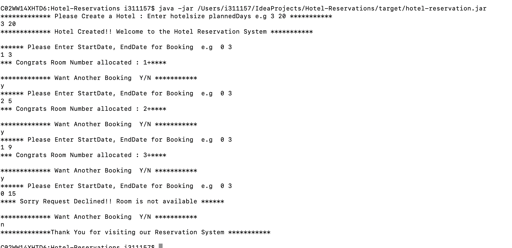

# Hotel-Reservations

* This is hotel reservation system where user can make a request to reserve a booking by providing start date and end date.
 
* Based on availabilty reservation system either confirms the bookings or reject it.

### Operation Supported
* createReservation(Integer start , Integer endDate)

### Prerequisite
```
    JDK1.8
    Maven
```

### Build the project
   ```mvn clean install```

* Once the executable jar is command to run the application:
```
java -jar path_to_hotel_reservation_jar\hotel-reservation.jar

```

### Sample Apllication Flow


